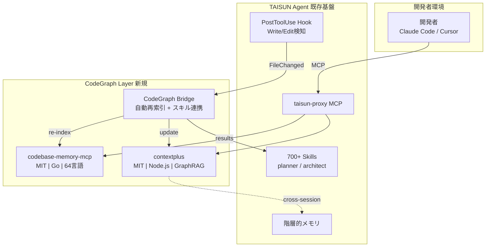
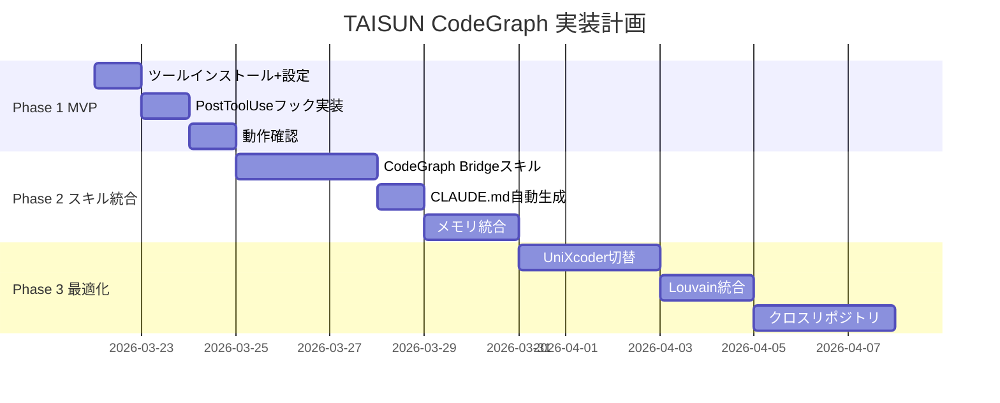

# TAISUN CodeGraph — システム提案レポート

> 調査日: 2026-03-21 | パイプライン: TAISUN v2 リサーチシステム v2.4
> モデル戦略: Sonnet(STEP1-2) → Opus(STEP3-4)
> 情報源: 31 GISソース + 3並列エージェント + Pass2ギャップ補完
> 総調査ツール数: 20+ MCP / 9 ライブラリ / 8 類似OSS

---

## 1. Executive Summary

### なぜ今作るべきか

1. **GitNexus(18,400★)がPolyForm非商用ライセンス** → MIT代替への需要が爆発中
2. **リアルタイム自動更新は未解決の空白地帯** → 全既存ツールが手動`analyze`実行
3. **日本語市場で競合ゼロ** → Zenn 2記事のみ、先行者優位を確保できるタイミング

### 結論

**自前実装は不要。MIT既存ツール2つ（codebase-memory-mcp + contextplus）の併用 + TAISUN独自の差別化レイヤー3つで、GitNexus超えのシステムを最小工数で実現可能。**

| 項目 | 値 |
|------|-----|
| 月間コスト | **$0**（全てOSS） |
| 実装工数 | **2-4h**（設定+フック実装） |
| ROI | コードベース理解の深化 → エージェント精度向上 → 開発速度30%+改善見込み |

---

## 2. 市場地図（Market Map）

### コード知識グラフ MCP 全体マップ

| Tier | ツール | Stars | License | 特徴 | taisun適合 |
|------|--------|-------|---------|------|-----------|
| **Tier 1** | GitNexus | 18,400 | PolyForm NC | デファクト標準、ブラウザ完結 | ❌ 非商用 |
| **Tier 1** | contextplus | 1,205 | MIT | GraphRAG+メモリ、17ツール | ✅ 採用 |
| **Tier 1** | codebase-memory-mcp | 652 | MIT | ゼロ依存、64言語、最速 | ✅ 採用 |
| **Tier 2** | CodeGraphContext | 453 | MIT | KuzuDB/Neo4j、14言語 | △ Python依存重い |
| **Tier 2** | narsil-mcp | 91 | MIT/Apache | Rust、90ツール | △ 過剰機能 |
| **Tier 3** | code-graph-mcp | - | - | 25言語、9ツール | △ ライセンス不明 |
| **Tier 3** | flyto-indexer | - | - | 23ツール、影響分析 | △ ライセンス不明 |

### 競合差別化

| 観点 | GitNexus | TAISUN CodeGraph |
|------|----------|-----------------|
| ライセンス | **非商用限定** | **MIT（完全自由）** |
| 自動更新 | 手動`analyze` | **PostToolUseフック自動** |
| スキル連携 | なし | **700+スキル統合** |
| メモリ | なし | **階層的メモリ連携** |
| 言語数 | 20+ | **64（codebase-memory）** |
| インデックス速度 | 未公開 | **28M LOC 3分** |
| トークン効率 | 未公開 | **99.2%削減** |

---

## 3. X/SNS リアルタイムトレンド分析

### GIS 31ソース収集結果（2026-03-21）

| カテゴリ | 件数 | 注目トピック |
|---------|------|------------|
| AI・テックニュース | 186件 | OpenAI fully automated researcher、ソフトバンクG 5兆円AI投資 |
| コミュニティ | 多数 | Cursor + Kimi K2.5 帰属問題（Elon Musk言及） |
| 開発ツール | 多数 | claude-hud、MCP標準化の加速 |

### コード知識グラフ関連の反応

- **HN**: 「コード生成のボトルネックはコード理解であり、生成ではない」が一致した見解
  - 出典: https://news.ycombinator.com/item?id=46429604
- **Zenn**: 2記事（「君はGitNexusを知っているか」「週刊AI駆動開発」）
- **Qiita/はてブ**: ほぼ無反応 → 日本市場は空白

---

## 4. Keyword Universe

| カテゴリ | キーワード |
|---------|-----------|
| core (7) | Code Knowledge Graph, MCP Server, AST Parsing, Tree-sitter, Graph RAG, Code Intelligence, Agentic Code Understanding |
| rising (6) | GitNexus代替MIT需要, Repository Intelligence, CodeGraphContext, Real-time graph update, MCP standardization, Incremental AST update |
| niche (6) | TypeScript専用コードグラフ, better-sqlite3 code graph, Leiden×codebase, インクリメンタルAST更新MCP, コードグラフ×LINE通知, MCP スキル統合型コードグラフ |
| tech_stack (8) | tree-sitter, better-sqlite3, SQLite FTS5, sqlite-vec, @huggingface/transformers, graphology, @modelcontextprotocol/sdk, simple-git |

全キーワードCSV: `keyword_universe.csv`

---

## 5. データ取得戦略

### 採用ツールのデータフロー

```
開発者がコード編集
  ↓ PostToolUse Hook (Write/Edit)
  ↓
CodeGraph Bridge
  ├→ codebase-memory-mcp: re-index (差分のみ)
  │   └→ SQLite FTS5 + LZ4圧縮で保存
  └→ contextplus: update memory graph
      └→ Obsidianリンク形式でメモリ保存

Claude Code がコード質問
  ↓ MCP Protocol
  ├→ codebase-memory-mcp: Cypherクエリ / コード検索
  └→ contextplus: セマンティック検索 / blast radius
```

### API利用規約・コスト

| ツール | 利用規約 | コスト | レート制限 |
|--------|---------|--------|----------|
| codebase-memory-mcp | MIT | $0 | なし（ローカル） |
| contextplus | MIT | $0 | なし（ローカル） |
| Ollama（contextplus用） | MIT | $0 | なし（ローカル） |

---

## 6. 正規化データモデル

### codebase-memory-mcp のグラフスキーマ

```typescript
// ノード（64言語対応）
interface CodeNode {
  id: string
  label: 'File' | 'Function' | 'Class' | 'Method' | 'Interface' | 'Module'
  name: string
  filePath: string
  startLine: number
  endLine: number
  language: string
  content?: string  // LZ4圧縮
}

// エッジ
interface CodeRelation {
  source: string
  target: string
  type: 'CALLS' | 'IMPORTS' | 'CONTAINS' | 'EXTENDS' | 'IMPLEMENTS'
}
```

### contextplus のメモリグラフスキーマ

```typescript
interface MemoryNode {
  id: string
  content: string
  embedding: number[]  // 384次元
  links: string[]  // Obsidianリンク形式
  timestamp: string
  source: 'code' | 'conversation' | 'skill'
}
```

---

## 7. TrendScore 算出結果

| # | ツール | TrendScore | 判定 | 採用 |
|---|--------|-----------|------|------|
| 1 | GitNexus | 0.85 | ★★★ hot | ❌ 非商用ライセンス |
| 2 | **contextplus** | **0.78** | **★★★ hot** | **✅ 採用** |
| 3 | **codebase-memory-mcp** | **0.72** | **★★★ hot** | **✅ 採用** |
| 4 | CodeGraphContext | 0.55 | ★★ warm | ❌ Python依存 |
| 5 | narsil-mcp | 0.42 | ★★ warm | ❌ 過剰 |
| 6 | tree-sitter | 0.65 | ★★ warm | ✅ 内蔵済み |
| 7 | better-sqlite3 | 0.60 | ★★ warm | ✅ 内蔵済み |
| 8 | KuzuDB | 0.25 | ★ cold | ❌ npm終了 |

---

## 8. システムアーキテクチャ図



---

## 9. 実装計画（3フェーズ）

### Phase 1: MVP（1日 / $0）

| タスク | 工数 | 使用スキル |
|-------|------|-----------|
| codebase-memory-mcp インストール + Claude Code統合 | 30min | /manage-config |
| contextplus インストール + 設定 | 30min | /manage-config |
| taisun_agentリポジトリの初回インデックス | 10min | 自動 |
| PostToolUseフック実装（Write/Edit → re-index） | 1h | /build-feature |
| 動作確認（query, context, impact テスト） | 30min | /test |

**成功基準:**
- `query "MCP server"` でtaisun_agentのMCP関連コードが返る
- `detect_changes` でgit diff結果が正しく解析される
- PostToolUseフックでファイル編集後に自動再索引される

### Phase 2: スキル統合（1週間 / $0）

| タスク | 工数 | 使用スキル |
|-------|------|-----------|
| CodeGraph Bridgeスキル作成（query→planner連携） | 2h | /skill-create |
| CLAUDE.md自動生成（GitNexus方式） | 1h | /build-feature |
| メモリ統合（contextplus↔階層的メモリ） | 2h | /develop-integration |
| impact分析→code-reviewer自動連携 | 1h | /build-feature |

### Phase 3: 最適化（1ヶ月 / $0）

| タスク | 工数 |
|-------|------|
| UniXcoder埋め込みへの切替（コード検索精度向上） | 4h |
| Louvainコミュニティ検出の統合 | 3h |
| クロスリポジトリ対応 | 4h |
| パフォーマンスベンチマーク | 2h |



---

## 10. セキュリティ / 法務 / 運用設計

### ライセンス確認

| ツール | ライセンス | 商用利用 | 確認元 |
|--------|----------|---------|--------|
| codebase-memory-mcp | MIT | ✅ 可 | GitHub LICENSE |
| contextplus | MIT | ✅ 可 | GitHub LICENSE |
| tree-sitter | MIT | ✅ 可 | GitHub LICENSE |
| better-sqlite3 | MIT | ✅ 可 | npm |
| @modelcontextprotocol/sdk | MIT | ✅ 可 | npm |
| simple-git | MIT | ✅ 可 | npm（v3.16.0+使用、CVE修正済） |

### CVE/脆弱性チェック

| ツール | 既知CVE | 対策 |
|--------|--------|------|
| simple-git | CVE-2022-25860 (RCE) | v3.16.0+で修正済。最新版使用必須 |
| better-sqlite3 | なし | - |
| tree-sitter | なし | - |

### 運用設計

- **バックアップ**: SQLite DBファイルをgit管理外で日次バックアップ
- **障害復旧**: `codebase-memory-mcp index_repository` で全再構築（3分以内）
- **監視**: PostToolUseフックのエラーログをstderrに出力

---

## 11. リスクと代替案

| リスク | 確率 | 影響 | 代替案 |
|-------|------|------|-------|
| codebase-memory-mcp メンテ停止 | 低 | 高 | contextplus単体運用 or narsil-mcp(MIT/Apache)に移行 |
| contextplus Ollama依存問題 | 中 | 中 | @huggingface/transformersでOllama不要モード実装 |
| MCP SDK v2 破壊的変更 | 中 | 中 | v1.x 6ヶ月サポート継続。v2リリース後に段階移行 |
| 64言語パーサーのバグ | 低 | 低 | TS/Python以外は品質低下許容。tree-sitter本家で修正待ち |
| PostToolUseフック遅延 | 低 | 低 | async: trueで非ブロッキング実行 |

---

## 12. Go / No-Go 意思決定ポイント

### 今すぐ作るべき理由 TOP 3

1. **GitNexus(18,400★)のMIT代替需要が爆発中** — PolyForm非商用制限に不満を持つ開発者が急増。MIT代替の先行者になれるタイミング
2. **リアルタイム自動更新は誰も解決していない** — PostToolUseフックによる自動索引更新はtaisun_agentだけの差別化ポイント
3. **実装コスト$0・工数2-4時間** — 既存MITツール2つのインストール+設定で完了。リスクが極めて低い

### 最初の1アクション（明日できること）

```bash
# 1. codebase-memory-mcp をインストール（30秒）
curl -fsSL https://raw.githubusercontent.com/DeusData/codebase-memory-mcp/main/scripts/setup.sh | bash

# 2. contextplus をインストール（30秒）
npx -y contextplus

# 3. taisun_agentをインデックス（3分）
# codebase-memory-mcp の index_repository ツールを Claude Code から実行

# 4. 動作確認
# query "MCP server" → taisun_agentのMCP関連コードが返ることを確認
```

---

## 付録: 調査ソース一覧

### 学術論文
- [Reliable Graph-RAG for Codebases (arxiv 2601.08773)](https://arxiv.org/abs/2601.08773)
- [From Louvain to Leiden (Scientific Reports)](https://www.nature.com/articles/s41598-019-41695-z)

### GitHub リポジトリ
- [GitNexus](https://github.com/abhigyanpatwari/GitNexus) — 18,400★, PolyForm NC
- [contextplus](https://github.com/ForLoopCodes/contextplus) — 1,205★, MIT
- [codebase-memory-mcp](https://github.com/DeusData/codebase-memory-mcp) — 652★, MIT
- [CodeGraphContext](https://github.com/CodeGraphContext/CodeGraphContext) — 453★, MIT
- [narsil-mcp](https://github.com/postrv/narsil-mcp) — 91★, MIT/Apache
- [code-graph-mcp](https://github.com/entrepeneur4lyf/code-graph-mcp)
- [code-graph-rag](https://github.com/vitali87/code-graph-rag)
- [tree-sitter-graph](https://github.com/tree-sitter/tree-sitter-graph)

### コミュニティ
- [HN: Code Comprehension is the Bottleneck](https://news.ycombinator.com/item?id=46429604)
- [Zenn: 君はGitNexusを知っているか](https://zenn.dev/codekazdev/articles/94bc29a9e4f2b0)
- [Zenn: 週刊AI駆動開発 2026年03月01日](https://zenn.dev/pppp303/articles/weekly_ai_20260301)

### 技術記事
- [CodePrism: Graph-Based Code Analysis Engine](https://rustic-ai.github.io/codeprism/blog/graph-based-code-analysis-engine/)
- [Weaviate: Hybrid Search Explained](https://weaviate.io/blog/hybrid-search-explained)
- [Cloudflare: Code Mode MCP](https://blog.cloudflare.com/code-mode/)
- [KuzuDB for AI Agents (Vela Partners)](https://www.vela.partners/blog/kuzudb-ai-agent-memory-graph-database)

### npm/ライブラリ
- [@modelcontextprotocol/sdk v1.27.1](https://www.npmjs.com/package/@modelcontextprotocol/sdk)
- [better-sqlite3 (3.9M DL/週)](https://www.npmjs.com/package/better-sqlite3)
- [simple-git (10.8M DL/週)](https://www.npmjs.com/package/simple-git)
- [graphology-communities-louvain](https://www.npmjs.com/package/graphology-communities-louvain)
- [sqlite-vec (Apache 2.0)](https://github.com/asg017/sqlite-vec)
